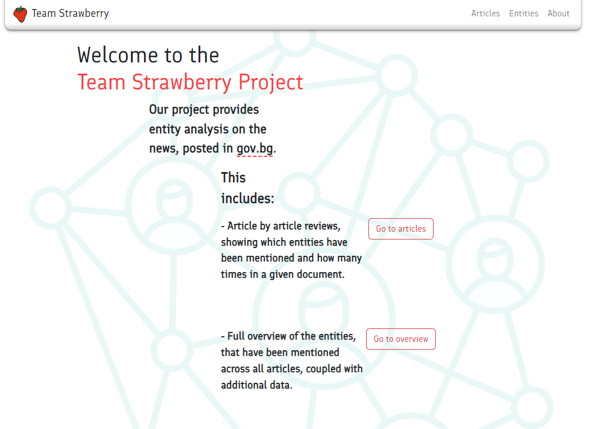
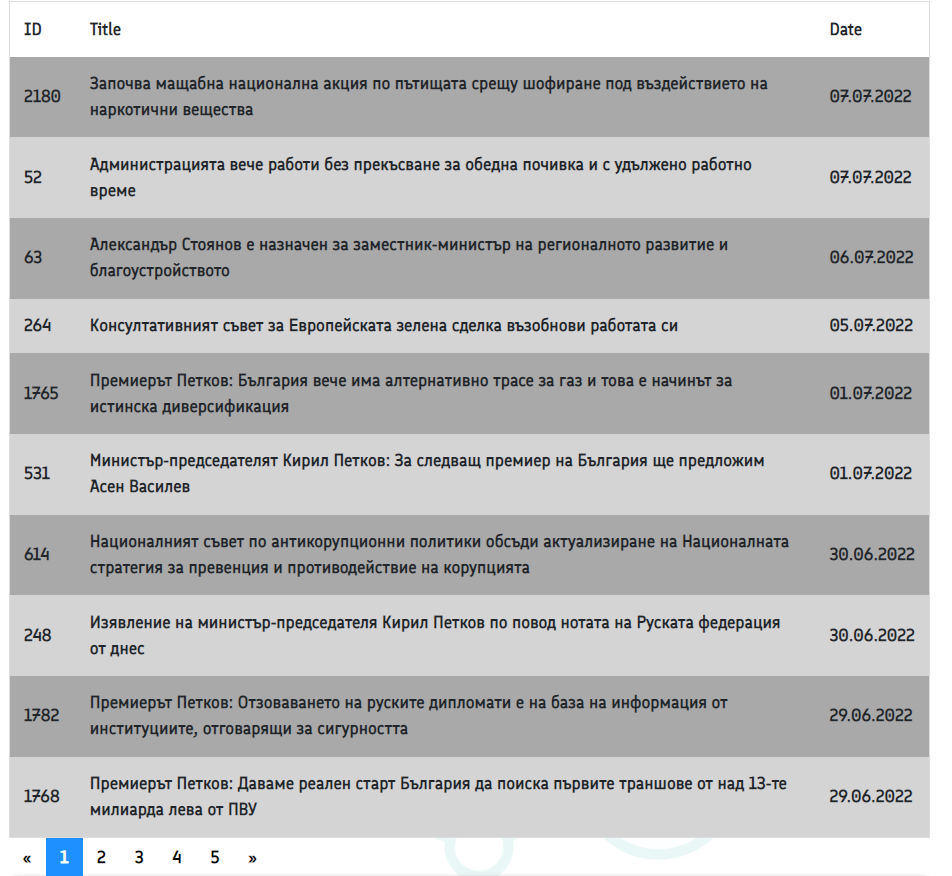
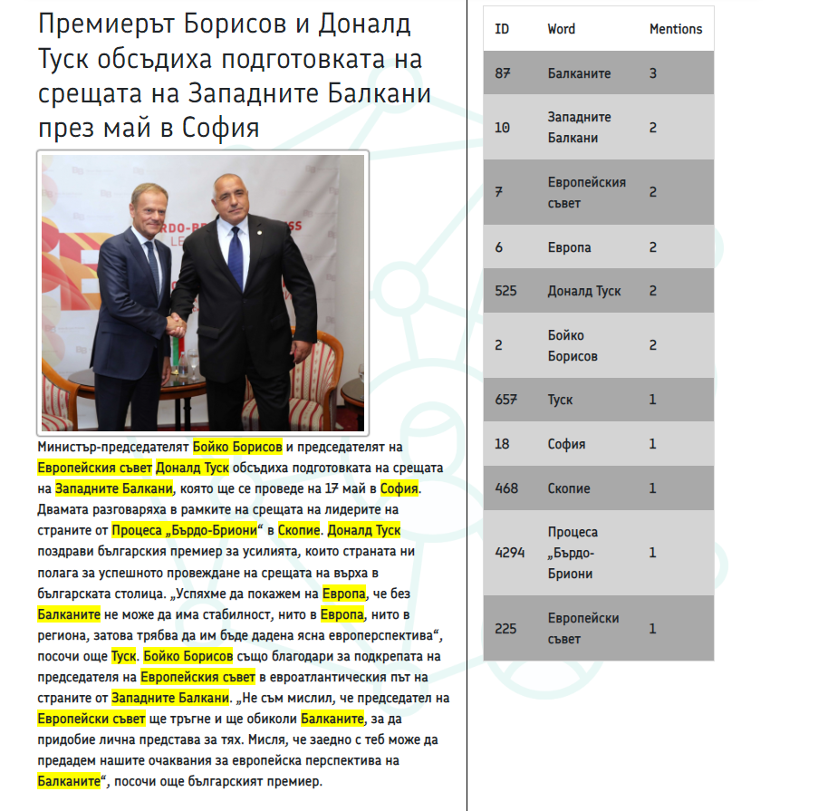
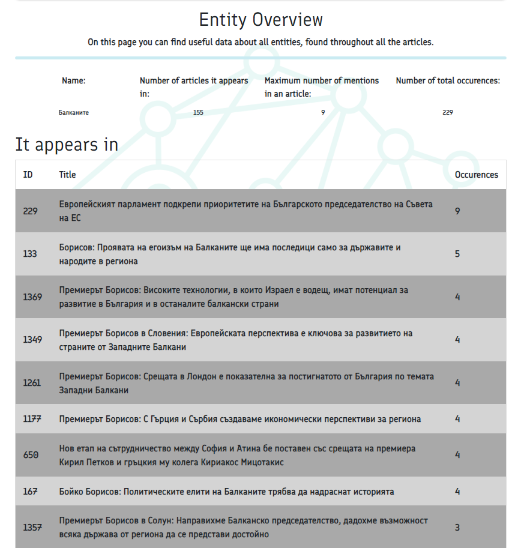

# Internship
<h3>Dependecies</h3>
Project for AdataPro Internship 
First start Virtual Environment and then install: 
<pre>pip install scrapy</pre>
<pre>pip install peewee</pre>
<pre>pip install scrapy_jsonschema</pre>
<pre>pip install django</pre>
<pre>pip install classla</pre>
 

<h3>To start The Crawler</h3>
To run the spiders generating the databases: 
<pre>python GovScraper/start.py</pre>
This code will run 2 spiders: 
First to generate the urls for all the articles in a links.db 
Second to generate articles.db with all the necessary information from the articles 

<h3>To start The NLP Process</h3>
<pre>python NLP/main.py</pre>
This code will get all of the name enteties in every article and put them in articles.db 

<h3>Set up the deployment environment</h3>
<h5>AWS</h5>
First, go to https://aws.amazon.com/ and create a free-tier account.
Then, choose the EC2 service.
After that, you have to pick on what OS the server will run. Choose Debian-11.
Then you get the option to configure the specs of the server through the 'instance-type'. We chose t2-micro.
<h5>SSH Access</h5>
To configure the SSH access to the cloud we used PuTTY. It can be downloaded from https://www.putty.org/.
From here on we have to configure the PuTTY with the .pem key we get from AWS.
<h5>Installing packages</h5>
You can install the packages you need with debian commands through the shell.
 

<h3>To start The Django site</h3>
<pre>cd internshipProj</pre>
<pre>python manage.py runserver</pre>
Lastly, go to http://127.0.0.1:8000/. 

<h2>Tour around the site</h2>
You will be greated by the index page. 

From there click on the articles link in the navbar to be able to select from every article present on the goverment site. 

They are sorted by date and reach back to around 2017 with about 2300 articles present. Clicking on a row will lead you to that article's page. 

The field is split in two. On the first side we can see the article with the title, image and body with all of the entities highlighted. And on the second is a table with the entities sorted by occurences in the article. Clicking on a row here, will lead us to the the page of the specified entity. 

On this page is shown the stats for the word amongst all articles and where it is found and consequently visit the specified article. 
